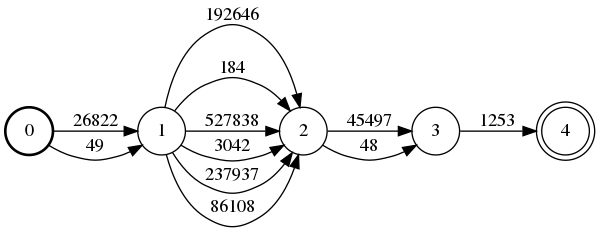

LING83800: Homework "3" - Extra Credit
==============

In this assignment, you will attempt to decode text for which each
word\'s characters have been randomly scrambled. For instance, given the
\"ciphertext\":

    ot tsgusge htta eth peedrtnsi nwte sfto no ihtew sacpsimtuesr sutj to sesm wiht hte imdae is ot easusm htat he sode 'nt laeryl syamipzhte htiw trhie ircsat lbsfiee .

you will attempt to recover the \"plaintext\":

    to suggest that the president went soft on white supremacists just to mess with the media is to assume that he does n't really sympathize with their racist beliefs .

To do this, you will:

1.  build a language model over plaintext tokens,
2.  write a function that constructs a lattice of possible plaintext
    tokens for a given scrambled sentence, and
3.  score this lattice by composing it with the language model and
    decode it using the Viterbi algorithm.

Part 1: language model construction
===================================

What to do
----------

Build an English language model over tokens:

-   Download the [2007 News Crawl
    data](http://www.statmt.org/wmt14/training-monolingual-news-crawl/news.2007.en.shuffled.gz)
    from [WMT \'14 translation
    task](http://www.statmt.org/wmt14/translation-task.html).
-   Decompress, tokenize, and case-fold the data.
-   Create a trigram token model with Kneser-Ney smoothing.

What to turn in
---------------

You do not need to turn in anything for this step.

Hints
-----

-   You can follow along with the [\"token model\"
    instructions for practicum 5](http://mr-pc.org/t/ling83800/practicum5.html).
-   Note that the command-line parts may take around an hour to run. If
    you\'re unsure if you\'re doing things right, try it with a smaller
    file (e.g., the first 1000 sentences), or try running things on the
    lab computers.

Part 2: lattice construction
============================

What to do
----------

Write a function that creates an unweighted \"sausage\" FSA containing
all the possible ways to unscramble a given sequence of scrambled words. For
instance, if the *i*th scrambled word is `tni`, then there will be arcs
from state *i* to state *i* + 1 with labels corresponding to the words
`nit`, `tin`, `nti`, etc. 

For the ciphertext:

    si tihs ti ?

the lattice might resemble:

where `49` maps to `is`, `184` maps to `this`, and `48` maps to `it`,
etc.

What to turn in
---------------

Please include your implementation of the lattice-generating function.

Hints
-----

-   You can use `itertools.permutations` to generate all possible
    orderings of a string:

        from typing import Iterator

        def possible_anagrams(anagrammed_token: str) -> Iterator[str]:
            for perm_list in itertools.permutations(anagrammed_token):
                # This returns a list of characters so we have to put it
                # back together.
                yield "".join(perm_list)

    Note that you can either generate an arc for every possible permutation of a scrambled word or test whether a word is in-vocabulary (i.e., present in the language model) before adding an arc for it. 
    
    To test if a word is in-vocabulary, you can load the symbol table
    (created by `ngramsymbols`) as follows:

        sym = pynini.SymbolTable.read_text("your.sym")  # Or whatever.

    Or, if you have already loaded the LM (as `lm`) then you can access
    this like so:

        sym = lm.output_symbols()

    To test whether a string is in-vocabulary, use:

        if sym.member("topiary"):
            ...

    Or, to obtain the arc label for an in-vocabulary string:

        idx = sym.find("topiary")
        if idx != pynini.NO_SYMBOL:
            # Add arc with input and output labels `idx`.
            ...

-   The easiest way to build the lattice is piece by piece, as follows:
    -   create an empty FST using `pynini.Fst()`
    -   add one state to the FST using `add_state`, then mark it as the
        start state using `set_start`
    -   for each scrambled token, add the next state using `add_state`,
        and add arcs using the `add_arcs` method
    -   mark the last state added as final using `set_final`

Part 3: decoding
================

What to do
----------

Score the test data lattices by composing them with the language model,
then decode them with the Viterbi algorithm.

What to turn in
---------------

Decode all the sentences in [test.ana](test.ana) and write them out to a file
`test.hyp`, one sentence per line with a single space between each
token, as in [dev.tok](dev.tok). *You must provide your
solution in this format to receive full credit.*

Hints
=====

-   The following shows a possible workflow for a single example.

        lattice = make_lattice(anagrammed_tokens, syms)  # From Part 2.
        # Uses the LM to score the lattice.
        lattice @= lm
        assert lattice.start() != pynini.NO_STATE_ID, "Composition failure"
        # `rmepsilon` hides any backoff/interpolation arcs.
        best_path = pynini.shortestpath(lattice).rmepsilon()
        print(best_path.stringify(sym))

Stretch goals
=============

-   Compare the runtime of only adding arcs for in-vocabulary tokens to adding arcs for all tokens.
-   Experiment with different language model settings, including:

    -   data sources
    -   model order
    -   smoothing method
    -   shrinking method

    and report which settings (if any) improve accuracy on the
    development set (gold data [dev.tok](dev.tok), anagrammed data [dev.ana](dev.ana), both
    included in this repo).

-   Implement anagram decoding using a hidden Markov model, as described
    in §4.2 of [Hauer & Kondrak
    2016](https://www.aclweb.org/anthology/Q16-1006).
